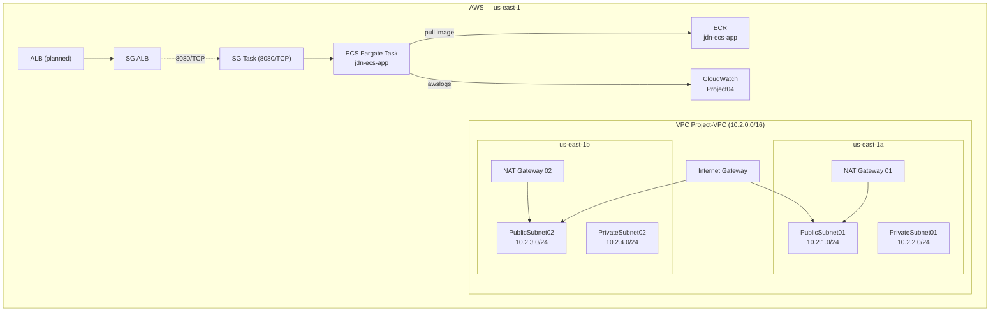

# Project 04 — AWS Infrastructure with Terraform (ECS Fargate)

[](https://www.terraform.io/)
[](https://registry.terraform.io/providers/hashicorp/aws/latest)

A **Terraform on AWS** study project that provisions the infrastructure needed to run a
**Node.js** application in a container on **ECS Fargate**, covering networking (VPC),
security (Security Groups), an image repository (ECR), a task definition, and logs
(CloudWatch).

> ⚠️ **Current status:** the root `main.tf` only instantiates the `network` module. The
> `security` and `ecs` modules have already been created, but are **not yet** referenced
> in the root module. See [Current status and caveats](#current-status-and-caveats).

---

## 📋 Overview

| Area | Resource |
| --- | --- |
| **Application** | Simple Node.js HTTP server that responds on port `8080` with the container hostname |
| **Container** | `dockerfile` based on `node:24` |
| **Network** | VPC `10.2.0.0/16` across 2 AZs, public/private subnets, Internet Gateway, and NAT Gateways |
| **Security** | Security Groups for the ALB and the ECS task |
| **ECS** | ECR repository, IAM roles, and a Fargate task definition (`awsvpc`, 256 CPU / 512 MB) |
| **Logs** | CloudWatch Log Group `Project04` via the `awslogs` driver |

## 🏗️ Architecture



## 📁 Project structure

```
.
├── app/
│   └── server.js                  # Node.js application (port 8080)
├── modules/
│   ├── ecs/
│   │   ├── main.tf                # ECR, IAM roles, task definition, CloudWatch
│   │   ├── output.tf              # (empty)
│   │   └── variables.tf           # (empty)
│   ├── network/
│   │   ├── main.tf                # VPC, subnets, IGW, NAT, route tables
│   │   ├── outputs.tf             # vpc_id, public_subnet_ids, private_subnet_ids
│   │   └── variables.tf           # (empty)
│   └── security/
│       ├── main.tf                # Security Groups (ALB and task)
│       ├── output.tf              # (empty)
│       └── variables.tf           # vpc_id
├── dockerfile                     # Node.js image
├── main.tf                        # AWS provider + modules (root)
└── .terraform.lock.hcl            # Provider lock (hashicorp/aws 6.62.0)
```

## 🧱 Provisioned resources

### `network` module

| Resource | Details |
| --- | --- |
| `aws_vpc` | `10.2.0.0/16` |
| Public subnets | `10.2.1.0/24` (us-east-1a) and `10.2.3.0/24` (us-east-1b) |
| Private subnets | `10.2.2.0/24` (us-east-1a) and `10.2.4.0/24` (us-east-1b) |
| Internet Gateway | Public route `0.0.0.0/0` |
| NAT Gateways | 1 per AZ (each with an Elastic IP) |
| Route tables | 1 public (IGW) + 2 private (NAT per AZ) |

### `security` module

| Resource | Details |
| --- | --- |
| `SG_ALB` | ALB Security Group (**no ingress rules yet**) |
| `SG_TASK` | ECS task Security Group |
| Ingress rule | Allows `8080/TCP` from `SG_ALB` to `SG_TASK` |

### `ecs` module

| Resource | Details |
| --- | --- |
| `aws_ecr_repository` | `jdn-ecs-app` — immutable tags + scan on push |
| IAM role `ecs-execution-role` | Policy `AmazonECSTaskExecutionRolePolicy` |
| IAM role `ecs-task-role` | Role assumed by the tasks |
| `aws_ecs_task_definition` | Fargate, `awsvpc`, 256 CPU / 512 MB, container `jdn-ecs-app` on port `8080`, logs in `Project04` |
| `aws_cloudwatch_log_group` | `Project04` |

## 📦 Modules — inputs and outputs

### `modules/network`

**Inputs:** none.

| Output | Description |
| --- | --- |
| `vpc_id` | ID of the created VPC |
| `public_subnet_ids` | Public subnet IDs |
| `private_subnet_ids` | Private subnet IDs |

### `modules/security`

| Input | Type | Description |
| --- | --- | --- |
| `vpc_id` | `string` | ID of the VPC where the Security Groups will be created |

**Outputs:** none.

### `modules/ecs`

**Inputs:** none. **Outputs:** none.

## ✅ Prerequisites

- [Terraform](https://www.terraform.io/downloads) ≥ 1.x
- [AWS CLI](https://aws.amazon.com/cli/) installed and configured
- [Docker](https://www.docker.com/) to build the image
- An AWS account with permission to create the resources above

## 🚀 Usage

### 1. Configure AWS credentials

```bash
aws configure
# or
export AWS_ACCESS_KEY_ID="..."
export AWS_SECRET_ACCESS_KEY="..."
export AWS_SESSION_TOKEN="..."   # optional
```

### 2. Initialize Terraform

```bash
terraform init
```

### 3. Review and apply

```bash
terraform plan
terraform apply
```

### 4. Build and push the image to ECR

```bash
# Log in to ECR (replace <account-id> and <region>)
aws ecr get-login-password --region us-east-1 \
  | docker login --username AWS --password-stdin <account-id>.dkr.ecr.us-east-1.amazonaws.com

# Build and push
docker build -t jdn-ecs-app .
docker tag jdn-ecs-app:latest <repo-url>:latest
docker push <repo-url>:latest
```

> `<repo-url>` is the URL of the `jdn-ecs-app` repository created by the `ecs` module.

## ⚠️ Current status and caveats

- **Modules not wired up in the root module:** `main.tf` only instantiates `module "network"`.
  The `module "security"` and `module "ecs"` blocks still need to be added, passing
  `vpc_id`, subnets, etc.
- **Hardcoded region:** the provider is hardcoded to `us-east-1`. Ideally this should be
  parameterized with a variable.
- **ALB Security Group has no ingress:** there is no rule yet allowing inbound traffic
  (e.g., `80/443` from the internet).
- **ALB, ECS cluster, and ECS service are missing:** the task definition exists, but there
  is no cluster/service to run it.
- **`latest` tag in the task definition:** the ECR repository uses
  `image_tag_mutability = "IMMUTABLE"`, which prevents overwriting the `latest` tag. For
  production, use versioned tags.
- **NAT Gateway cost:** each NAT has an hourly cost + data transfer. Remember to run
  `terraform destroy` when you are done testing.
- **Formatting:** `terraform fmt -check` reports files that are not formatted
  (`main.tf`, `modules/ecs/main.tf`, `modules/network/main.tf`, `modules/network/outputs.tf`).
  Run `terraform fmt -recursive` if you want to standardize them.

## 🧹 Clean up

```bash
terraform destroy
```

> If the ECR repository has images, `terraform destroy` may fail to delete it — remove the
> images manually in the console/CLI first.

## 📝 License

To be defined.
