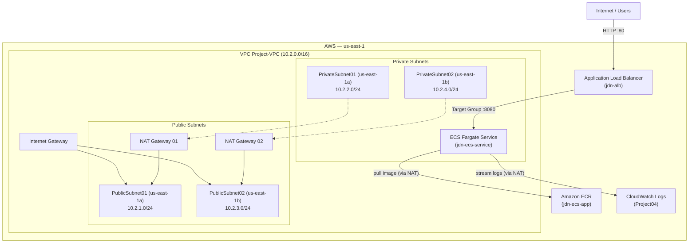

# Project 04 — AWS Infrastructure with Terraform (ECS Fargate)

[](https://www.terraform.io/)
[](https://registry.terraform.io/providers/hashicorp/aws/latest)

A **Terraform on AWS** production-ready project that provisions the full infrastructure needed to run a **Node.js** application in a container on **AWS ECS Fargate**, fronted by an **Application Load Balancer (ALB)**, covering networking (VPC across 2 AZs), security (Security Groups), container registry (ECR with lifecycle policy), ECS Cluster, Task Definition, ECS Service, and logs (CloudWatch).

---

## 📋 Overview

| Area | Resource | Details |
| --- | --- | --- |
| **Application** | Node.js HTTP Server | Responds on port `8080` with the container hostname |
| **Container** | `dockerfile` | Based on `node:24` |
| **Network** | VPC `10.2.0.0/16` | Multi-AZ (us-east-1a, us-east-1b), 2 public subnets, 2 private subnets, Internet Gateway, 2 NAT Gateways |
| **Load Balancer** | Application Load Balancer | Internet-facing ALB in public subnets, Target Group (`ip` mode, port `8080`, health check `/`), HTTP Listener on port `80` |
| **Security** | Security Groups | ALB SG (HTTP 80 ingress, egress to task SG) and Task SG (ingress 8080 from ALB SG, full egress for ECR & CloudWatch) |
| **ECS** | Fargate Service & Cluster | ECS Cluster (Container Insights), Task Definition (256 CPU / 512 MB), and ECS Service maintaining tasks in private subnets |
| **Registry** | Amazon ECR | Repository `jdn-ecs-app` with image scanning on push, `force_delete` enabled, and lifecycle policy (keeps last 10 images) |
| **Logs** | CloudWatch Logs | Log Group `Project04` via `awslogs` driver with 7-day retention policy |

---

## 🏗️ Architecture



---

## 📁 Project Structure

```
.
├── app/
│   └── server.js                  # Node.js application (port 8080)
├── modules/
│   ├── alb/
│   │   ├── main.tf                # ALB, Target Group (ip mode), Listener
│   │   ├── outputs.tf             # alb_id, alb_arn, alb_dns_name, target_group_arn
│   │   └── variables.tf           # vpc_id, public_subnet_ids, alb_security_group_id
│   ├── ecs/
│   │   ├── main.tf                # ECR, Lifecycle Policy, IAM roles, Task Def, Cluster, Service, CloudWatch
│   │   ├── output.tf              # cluster_*, service_*, ecr_repository_url, task_definition_arn
│   │   └── variables.tf           # aws_region, private_subnet_ids, task_security_group_id, target_group_arn
│   ├── network/
│   │   ├── main.tf                # VPC, subnets, IGW, NAT Gateways, route tables
│   │   ├── outputs.tf             # vpc_id, public_subnet_ids, private_subnet_ids
│   │   └── variables.tf           # (optional overrides)
│   └── security/
│       ├── main.tf                # Security Groups & Rules (ALB and Task ingress/egress)
│       ├── output.tf              # alb_security_group_id, task_security_group_id
│       └── variables.tf           # vpc_id
├── dockerfile                     # Node.js container image
├── main.tf                        # AWS provider + Module orchestration (root)
├── variables.tf                   # Root variables (aws_region)
├── outputs.tf                     # Root outputs (alb_dns_name, ecr_repository_url, vpc_id, etc.)
└── .terraform.lock.hcl            # Provider lock file
```

---

## 🧱 Provisioned Resources

### `network` module
- **VPC**: `10.2.0.0/16`
- **Subnets**: 2 public (`10.2.1.0/24`, `10.2.3.0/24`) and 2 private (`10.2.2.0/24`, `10.2.4.0/24`) across `us-east-1a` and `us-east-1b`.
- **Gateways**: 1 Internet Gateway + 2 NAT Gateways (each with dedicated Elastic IP).
- **Routing**: 1 Public Route Table (IGW) and 2 Private Route Tables (NAT per AZ).

### `security` module
- **`SG_ALB`**: Allows inbound HTTP (`80/TCP`) from `0.0.0.0/0`. Allows outbound traffic to `SG_TASK` on port `8080/TCP`.
- **`SG_TASK`**: Allows inbound traffic from `SG_ALB` on port `8080/TCP`. Allows full outbound traffic (`-1` to `0.0.0.0/0`) for ECR pulls, CloudWatch logs, and NAT access.

### `alb` module
- **`aws_lb`**: Public Application Load Balancer in public subnets with `SG_ALB`.
- **`aws_lb_target_group`**: Target group pointing to container port `8080` in `ip` target mode with health check on `/`.
- **`aws_lb_listener`**: Listener on port `80` forwarding to the Target Group.

### `ecs` module
- **`aws_ecr_repository`**: `jdn-ecs-app` with image scan on push, `force_delete = true`, and automated lifecycle cleanup policy.
- **IAM Roles**: `ecs-execution-role` (with `AmazonECSTaskExecutionRolePolicy`) and `ecs-task-role`.
- **`aws_cloudwatch_log_group`**: `Project04` with 7-day retention period.
- **`aws_ecs_cluster`**: `jdn-ecs-cluster` with Container Insights enabled.
- **`aws_ecs_task_definition`**: Fargate task definition (256 CPU / 512 MB) logging to CloudWatch.
- **`aws_ecs_service`**: Fargate service running in private subnets, registering tasks into the ALB Target Group.

---

## 📦 Root Outputs

| Output | Description |
| --- | --- |
| `alb_dns_name` | Public DNS URL of the Load Balancer to access the app |
| `ecr_repository_url` | Full repository URL for pushing Docker images |
| `ecs_cluster_name` | Name of the ECS cluster |
| `ecs_service_name` | Name of the ECS service |
| `vpc_id` | ID of the created VPC |
| `public_subnet_ids` | IDs of the public subnets |
| `private_subnet_ids` | IDs of the private subnets |

---

## 🚀 Deployment Guide

### 1. Configure AWS Credentials

```bash
aws configure
# or
export AWS_ACCESS_KEY_ID="..."
export AWS_SECRET_ACCESS_KEY="..."
export AWS_DEFAULT_REGION="us-east-1"
```

### 2. Initialize Terraform

```bash
terraform init
```

### 3. Build & Push Initial Docker Image

Before the ECS Service starts its tasks, build and push the container image to ECR:

```bash
# 1. Target apply ECR first so the repository is available
terraform apply -target=module.ecs.aws_ecr_repository.jdn_repo -auto-approve

# 2. Retrieve ECR URL
REPO_URL=$(terraform output -raw ecr_repository_url)

# 3. Authenticate Docker with ECR
aws ecr get-login-password --region us-east-1 | docker login --username AWS --password-stdin "$REPO_URL"

# 4. Build and push the image
docker build -t jdn-ecs-app -f dockerfile .
docker tag jdn-ecs-app:latest "$REPO_URL:latest"
docker push "$REPO_URL:latest"
```

### 4. Apply Complete Infrastructure

```bash
terraform apply
```

Once the apply is complete, Terraform will display the `alb_dns_name`:

```bash
curl http://<alb_dns_name>
# Output: Hello from ECS Fargate! Host: ...
```

---

## 🧹 Clean Up

To destroy all provisioned infrastructure:

```bash
terraform destroy
```

> **Note:** The ECR repository has `force_delete = true`, allowing `terraform destroy` to succeed without needing to manually delete container images first.
